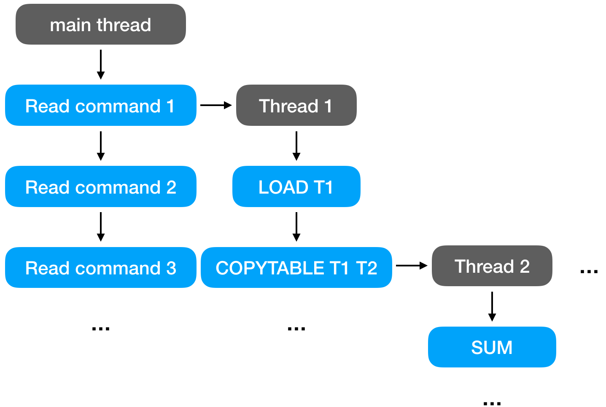

# `LemonDB` by TEAM 16

> This document contains commercially sensitive information. For internal use only!!

This version of `lemonDB` is the new version that was recovered from the server `ve482`. The whole project can be found in the git server of the company (`git@ve482`). To achieve a better performance, we take full advantage of multithreading programming so that the database can overcome the I/O bound in the single-thread.

The compiler here used is `CMake 3.12`. As far as our testing and compiling, the version above 3.12 would be OK for compiling.

## File Organization

The file directory tree is shown below.

.
├── CMakeLists.txt
├── db
│   ├── Database.cpp
│   ├── Database.h
│   ├── Table.cpp
│   └── Table.h
├── main.cpp
├── query
│   ├── Query.cpp
│   ├── Query.h
│   ├── QueryBuilders.cpp
│   ├── QueryBuilders.h
│   ├── QueryParser.cpp
│   ├── QueryParser.h
│   ├── QueryResult.cpp
│   ├── QueryResult.h
│   ├── data
│   │   ├── AddQuery.cpp
│   │   ├── AddQuery.h
│   │   ├── CountQuery.cpp
│   │   ├── CountQuery.h
│   │   ├── DeleteQuery.cpp
│   │   ├── DeleteQuery.h
│   │   ├── DuplicateQuery.cpp
│   │   ├── DuplicateQuery.h
│   │   ├── InsertQuery.cpp
│   │   ├── InsertQuery.h
│   │   ├── MaxQuery.cpp
│   │   ├── MaxQuery.h
│   │   ├── MinQuery.cpp
│   │   ├── MinQuery.h
│   │   ├── SelectQuery.cpp
│   │   ├── SelectQuery.h
│   │   ├── SubQuery.cpp
│   │   ├── SubQuery.h
│   │   ├── SumQuery.cpp
│   │   ├── SumQuery.h
│   │   ├── SwapQuery.cpp
│   │   ├── SwapQuery.h
│   │   ├── UpdateQuery.cpp
│   │   └── UpdateQuery.h
│   └── management
│       ├── CopyTableQuery.cpp
│       ├── CopyTableQuery.h
│       ├── DropTableQuery.cpp
│       ├── DropTableQuery.h
│       ├── DumpTableQuery.cpp
│       ├── DumpTableQuery.h
│       ├── ListTableQuery.cpp
│       ├── ListTableQuery.h
│       ├── ListenQuery.cpp
│       ├── ListenQuery.h
│       ├── LoadTableQuery.cpp
│       ├── LoadTableQuery.h
│       ├── PrintTableQuery.cpp
│       ├── PrintTableQuery.h
│       ├── QuitQuery.cpp
│       ├── QuitQuery.h
│       ├── TruncateTableQuery.cpp
│       └── TruncateTableQuery.h
└── utils
    ├── formatter.h
    └── uexception.h

## Design Details - Single Thread

The main structure mostly inherits from the previous lost code fragments. Therefore we would not detailly introduce the design here.

- overall design
	The overall design inherits the overall data structure and flows. To be more specific, when the program gets a file from `--listen`, it will firstly parse one line from the file, and then take the parsed result into the executing part. Repeating this process until the end of file. In the meanwhile, there is a variable `count` to get the count of each command.

- overall data structure
	The overall data structure inherites the previous design on data structure. All data storation of our database is implemented in the directory `./db`. The data in a specific table is implemented in `Table.cpp/.h`. All tables are stored in the database `Database.cpp/.h`.

- parsing the command
	In the parsing, the commands are classified as two kinds: complex queries and simple queries. The complex queries mainly consists of data manupilation commands, and the simple queries are the rest commonds.

- executing the command
	In the executing part, the parsed command would be passed into the class of `Query` and get the corresponding function to be called. The implementation of this function are mainly the inherited class of class `Query`. The class and function implementation can be found in the `./query/data` and `./query/management`.

	The implementation mainly consists of two types: `management` and `data`. The `management` is the command to manage the tables like `COPYTABLE`, `LOAD`, or `DUMP`. The `data` is the command that will manipulate data from the table like `DELETE`, `UPDATE`, `SELECT`, or `ADD`.

## Design Detailes - Multithread

To protect the structure of the previous codes and data sturcture, we decide to maintain the internal stucture and then the multithreading implementation is mainly done in `./main.cpp`.The overall idea for multithreading is to maintain a `std::unordered_map<std::string, std::list<Query::Ptr> > queryMap` so the result would be stored by `TableName` or just by table. This method would give each table a thread to run so there would be easier to implement and avoid some common issues in multithreading programming (more details would be introduced in the later section).

### Query Data Structure

The parsed query is stored seperately from different table according to our design. To achieve that goal, we have some global variables to store them. The query data structrue here is:

```c++
std::unordered_map<std::string, std::list<Query::Ptr> > queryMap;
```

After getting a parsed query, the `main` thread would add the query into the list of the corresponding table in `queryMap`:

```c++
queryMap[query->tableName()].emplace_back(move(query));
```

Then when the thread of the corresponding table is available for executing, the thread would get the first query in the list and do execution of the query:

```c++
Query::Ptr *query = &queryMap[tableName].front();
QueryResult::Ptr result = (*query)->execute();
```

To explain more clearly, we give a simple example here. For example, we have two threads for two tables. The process shown in the figure below.



### Creation of New Threads

According to our design, we maintain commands of each table in each thread, and therefore the craetion of a new thread would be easy and simple. More specifically, when we meet `COPYTABLE` and `LOAD`, the new thread would be created, since only these two commands would create a new table in our database among all the types of commonds. 

To implement the idea, after a common query, there is a `if` statement to get these two commands.

```c++
if (query->cmdName() == "LOAD") {
	// implement detailes for thread creation
}
if (query->cmdName() == "COPYTABLE") {
	// implement detailes for thread creation
}
```

Then for the new threads, we would store the thread in the list for thread as a global variable: 

```c++
std::vector<std::thread *> threadList;
```

by the implementation:

```c++
tableMutex[query->getNewTableName()].lock();
std::thread *currentThread = new std::thread(&tableThread, query->getNewTableName());
threadList.push_back(currentThread);
```


### Output List

To make the concurrent result in the right sequence, we put all the result into the list of thread as another global variable:

```c++
std::list<std::string> resultList;
```

Then we output the result according to the sequence.


### Performance Improvements

We test our `LemonDB` with `sample/test.query` on a six-thread computer. It takes around 5.8 seconds with a single thread, but with multithreads, it only takes 3.6 seconds, which improves about 38%. 

However, in the test query, it only loads 3 tables, and most queries only execute one of it. If the test query has more tables to execute, our multi-thread program will have a better performance, and the improvement could be more than 50%.

Besides, we test the I/O on the case `sample/many_read_dup.query` and get the result on multithread for 10.979s and single thread in 4.201s.

## Common Issues on Multithreading 

1. **Race Condition**

	- write or read a copied table
When the main thread reads a `COPYTABLE` query, for exmaple `COPYTABLE A new_A`, it will be assigned to the corresponding thread and put at the waitlist, `std::list<Query::Ptr>`. If the next query wants to read or write the `Query->targetTable`, `new_A`, since `new_A` has not been built yet, the race condition happens. 

We use `std::mutex` to lock the thread of table that has not been initialized yet to prevent such condition.

	- load a dumping table

If a table is loaded, dumped and loaded again, it will create two threads, and the second thread must wait until the table has been dumped. Otherwise, it will load the wrong data, so we set up a `std::mutex` to lock the thread dealing the same table.

2. **Output Sequence**

In the single-thread program, all the queries are finished in order and can be printed one by one. However, in the multi-threading program, different queries may be running in parallel and need different time to be executed. If we use the old strategy, the output sequence will be messed up. To solve such problem, we build a list to store the output strings according to the counter, and at the end of the program, the output will be printed at once.

3. **Deadlock**

We create new threads according to the table, so it is impossible to write and read the same table at the same time. The queries come to the waitlist one by one, and they will be executed in the right order. Therefore, a deadlock is not likely to occur based on our design.

## Information for the future LemonDB developers

1. **Improvement on mulththreading**

	- parallel reading

The multithread strategy can be improved. If there are available threads, the read type queries of the same table can be executed at the same time, and it could improve the efficiency greatly based on more concurrency. 

	- priority scheduling

Also, the tables should have priorities to be executed, because larger tables usually take longer time. To improve the CPU utilization, a larger table should be executed in a higher priority. 

	- higher utilization of `main` thread

In addition, the main thread can join executing data after read and assign the queries, so that all the threads are used.

2. **Ignoration on some useless commands**

This future idea is a little tricky. When a table is loaded and has some commonds that has no output and has no impaction for the data that stored (like `DUMP`), then this kind of commonds and loading can be ignored since that would have no impact on the user's result and table stored. 

3. **Less Iteration**

In the detailed implementation, when we need to execute commands that need to iterate all rows in a table, like `SELECT`, `SUB`, we can do the judge of the `WHERE` in just one iteration on the specific table. That would decrease the number of iteration on tables. However, the implementation would be a little complex and there would be more race conditions happening during multithreading programming.

## Copyright

Lemonion Inc. 2018

